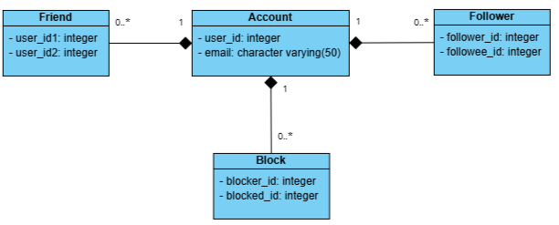

# Friends Management API

## 1. Objective
To design, develop, and deliver a RESTful API that enables management of friend connections, subscriptions, blocks, and update notifications between users identified by email addresses.

## 2. Scope of Work
Project API features:

1. **Create a friend connection between two email addresses.**  
   - **API name**: /addFriend  
   - **Method**: POST  
   - **Description**: User A adds user B as a friend  
      - *Note: friends can see each other's updates*  
   - **JSON request**:  
     ```json
     { 
         "friends": 
         [ 
               "andy@example.com", 
               "john@example.com" 
         ] 
     }
     ```  
   - **Response**:  
   - **Success**:  
     ```json
     { 
         "success": true 
     }
     ```  
   - **Fail**:  

     - **User not found** - Returned when one or both emails do not exist:
     ```json
     { 
         "status": "error",
         "message": "User not found",
         "statusCode": 1002
     }
     ```

     - **Invalid request** - Returned when the request does not contain exactly 2 emails:
     ```json
     { 
         "status": "error",
         "message": "Invalid request",
         "statusCode": 1001
     }
     ```

     - **Emails must be different** - Returned when the request contain 2 of the same email:
     ```json
     { 
         "status": "error",
         "message": "Emails must be different",
         "statusCode": 1009
     }
     ```

     - **Users are already friends** - Returned when the two users are already friends:
     ```json
     { 
         "status": "error",
         "message": "Users are already friends",
         "statusCode": 1003
     }
     ```

2. **Retrieve the friends list for an email address.**  
   - **API name**: /getFriends  
   - **Method**: POST  
   - **Description**: User A gets list of all friends  
   - **JSON request**:  
     ```json
     {   
         "email": "andy@example.com"  
     }
     ```  
   - **Response**:  
   - **Success**:  
     ```json
     {   
         "success": true, 
         "friends": 
         [ 
               "john@example.com" 
         ],    
         "count": 1 
     }
     ```  

   - **Fail**:  
     - **User not found** - Returned when email do not exist:
     ```json
     { 
         "status": "error",
         "message": "User not found",
         "statusCode": 1002
     }
     ```

3. **Retrieve common friends list between two email addresses.**  
   - **API name**: /getCommonFriends  
   - **Method**: POST  
   - **Description**: User A gets list of mutual friends with user B  
   - **JSON request**:  
     ```json
     { 
         "friends": 
         [ 
               "andy@example.com", 
               "john@example.com" 
         ] 
     }
     ```  
   - **Response**:  
   - **Success**:  
     ```json
     {   
         "success": true, 
         "friends": 
         [ 
               "common@example.com" 
         ], 
         "count": 1 
     }
     ```  
   - **Fail**:  

     - **User not found** - Returned when one or both emails do not exist:
     ```json
     { 
         "status": "error",
         "message": "User not found",
         "statusCode": 1002
     }
     ```

     - **Invalid request** - Returned when the request does not contain exactly 2 emails:
     ```json
     { 
         "status": "error",
         "message": "Invalid request",
         "statusCode": 1001
     }
     ```
     
     - **Emails must be different** - Returned when the request contain 2 of the same email:
     ```json
     { 
         "status": "error",
         "message": "Emails must be different",
         "statusCode": 1009
     }
     ```


4. **Subscribe to updates from another email address.**  
   - **API name**: /subscribeUpdates  
   - **Method**: POST  
   - **Description**: User A follows user B for updates
      - *Note: Following does not add as friend*  
   - **JSON request**:  
     ```json
     { 
         "requestor": "lisa@example.com", 
         "target": "john@example.com" 
     }
     ```  
   - **Response**:  
   - **Success**:  
     ```json
     { 
         "success": true 
     }
     ```  
   - **Fail**:  
     - **User not found** - Returned when one or both emails do not exist:
     ```json
     { 
         "status": "error",
         "message": "User not found",
         "statusCode": 1002
     }
     ```

     - **Invalid request** - Returned when the request does not contain exactly 2 emails:
     ```json
     { 
         "status": "error",
         "message": "Invalid request",
         "statusCode": 1001
     }
     ```

     - **Emails must be different** - Returned when the request contain 2 of the same email:
     ```json
     { 
         "status": "error",
         "message": "Emails must be different",
         "statusCode": 1009
     }
     ```

     - **Already followed** - Returned when user A is already following user B:
     ```json
     { 
         "status": "error",
         "message": "User is already followed",
         "statusCode": 1005
     }
     ```

5. **Block updates from another email address.**  
   - **API name**: /blockUpdates  
   - **Method**: POST  
   - **Description**: User A blocks user B
      - **Note**: If user B follows user A, they are removed. They cannot follow or add each other as friends.
   - **JSON request**:  
     ```json
     { 
         "requestor": "andy@example.com", 
         "target": "john@example.com" 
     }
     ```  
   - **Response**:  
   - **Success**:  
     ```json
     { 
         "success": true 
     }
     ```  
   - **Fail**:  
     - **User not found** - Returned when one or both emails do not exist:
     ```json
     { 
         "status": "error",
         "message": "User not found",
         "statusCode": 1002
     }
     ```

     - **Invalid request** - Returned when the request does not contain exactly 2 emails:
     ```json
     { 
         "status": "error",
         "message": "Invalid request",
         "statusCode": 1001
     }
     ```

     - **Emails must be different** - Returned when the request contain 2 of the same email:
     ```json
     { 
         "status": "error",
         "message": "Emails must be different",
         "statusCode": 1009
     }
     ```

     - **Already blocked** - Returned when user A has already blocked user B:
     ```json
     { 
         "status": "error",
         "message": "User is already blocked",
         "statusCode": 1007
     }
     ```

6. **Retrieve all update recipients for an email address.**  
   - **API name**: /getUpdateRecipients  
   - **Method**: POST  
   - **Description**: User A gets list of recipients of user A's updates
      - **Note**: Recipents include user A's friends, followers and users @mentioned in the update **that has not blocked A** 
   - **JSON request**:  
     ```json
     { 
         "sender": "john@example.com", 
         "text": "Hello! kate@example.com" 
     }
     ```  
   - **Response**:  
   - **Success**:  
     ```json
     { 
         "success": true, 
         "recipients": 
         [ 
               "lisa@example.com", 
               "kate@example.com" 
         ] 
     }
     ```  
   - **Fail**:  
     - **User not found** - Returned when email do not exist:
     ```json
     { 
         "status": "error",
         "message": "User not found",
         "statusCode": 1002
     }
     ```
     
     - **Invalid request** - Returned when "text" field of request is empty/null:
     ```json
     { 
         "status": "error",
         "message": "Invalid request",
         "statusCode": 1001
     }
     ```


## 3. Milestones & Time Frames
- **Time Frame**: 4 Weeks 
- **Start date**: 14 August, 2025


| Date Range | Milestone | Description |
|------------|-----------|-------------|
| 14/08 - 15/08 | Project Setup and Planning | Define project requirements, create initial repository, setup environment, dependencies, and database schema. |
| 16/08 - 18/08 | Friend Connection API | Implement `addFriend` service, handle edge cases (already friends), unit tests for friend creation. |
| 19/08 - 21/08 | Friends List API | Implement `getFriends` service, ensure correct reactive handling, unit tests for friends list retrieval. |
| 22/08 - 24/08 | Common Friends API | Implement `getCommonFriends` service, test mutual friend retrieval, handle edge cases. |
| 25/08 - 27/08 | Subscription API | Implement `subscribeUpdates` service, test following functionality. |
| 28/08 - 30/08 | Blocking API | Implement `blockUpdates` service, handle friend/non-friend blocking logic, unit tests. |
| 31/08 - 02/09 | Update Recipients API | Implement `getUpdateRecipients` service, handle friends, followers, mentions, and blocked users. |
| 03/09 - 05/09 | Integration and Testing | Combine all services, test flows (friend add -> updates -> recipients), fix bugs. |
| 06/09 - 08/09 | API Documentation | Write API docs, create Postman collection. |
| 09/09 - 10/09 | Deployment and Final Review | Deploy project to staging or server, final testing, ensure reactive non-blocking performance. |


## 4. Database Design
The system will use a relational database with the following core tables:  
- **Account** (stores unique user email addresses)  
- **Friend** (friendship relationships)  
- **Follow** (follow relationships)  
- **Block** (blocking relationships)  

**Database ER Diagram**  


SQL Script to recreate the database: [schema.sql](./sql/frienddb.sql)

## 5. Technical Specifications
- **Architecture:** RESTful API.
- **Data Format:** JSON for all requests and responses.
- **Persistence:** Relational database (PostgreSQL).
- **Frameworks:** Java/Spring Boot.
- **Error Handling:** Standard HTTP status codes and error messages.
- **Security:** Input validation, prevention of duplicate connections, and blocking logic enforcement.
